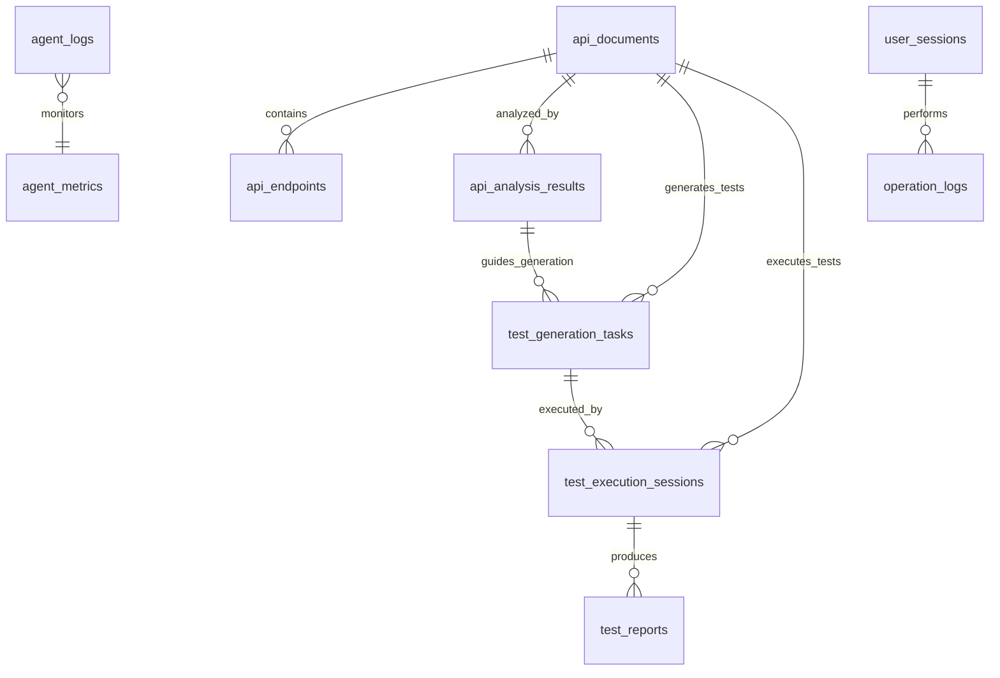

# API自动化系统数据库表结构文档

## 概述

本文档描述了API自动化系统的完整数据库表结构，包括表设计、字段说明、索引优化和关系映射。

## 数据库设计原则

1. **规范化设计**: 遵循第三范式，减少数据冗余
2. **性能优化**: 合理设计索引，支持高频查询
3. **扩展性**: 预留扩展字段，支持功能迭代
4. **数据完整性**: 外键约束和数据验证
5. **审计追踪**: 完整的创建和更新时间记录

## 核心业务表

### 1. API文档表 (api_documents)

存储上传和解析的API文档信息。

```sql
CREATE TABLE api_documents (
    id SERIAL PRIMARY KEY,
    doc_id VARCHAR(100) UNIQUE NOT NULL,
    session_id VARCHAR(100) NOT NULL,
    
    -- 文件信息
    file_name VARCHAR(255) NOT NULL,
    file_path VARCHAR(500) NOT NULL,
    file_size BIGINT DEFAULT 0,
    file_hash VARCHAR(64),
    
    -- 文档格式和版本
    doc_format VARCHAR(50) NOT NULL,  -- openapi, swagger, postman
    doc_version VARCHAR(20),
    
    -- API基本信息
    api_info JSONB NOT NULL,
    schemas JSONB DEFAULT '{}',
    security_schemes JSONB DEFAULT '{}',
    
    -- 统计信息
    endpoints_count INTEGER DEFAULT 0,
    schemas_count INTEGER DEFAULT 0,
    
    -- 解析状态和结果
    parse_status VARCHAR(20) DEFAULT 'CREATED',
    parse_errors JSONB DEFAULT '[]',
    parse_warnings JSONB DEFAULT '[]',
    confidence_score FLOAT DEFAULT 0.0,
    processing_time FLOAT DEFAULT 0.0,
    
    -- 用户和权限
    uploaded_by VARCHAR(100),
    is_public BOOLEAN DEFAULT FALSE,
    
    -- 标签和分类
    tags JSONB DEFAULT '[]',
    category VARCHAR(50),
    
    -- 状态管理
    is_active BOOLEAN DEFAULT TRUE,
    is_deleted BOOLEAN DEFAULT FALSE,
    
    -- 时间戳
    created_at TIMESTAMP DEFAULT CURRENT_TIMESTAMP,
    updated_at TIMESTAMP DEFAULT CURRENT_TIMESTAMP
);

-- 索引
CREATE INDEX idx_api_documents_doc_id ON api_documents(doc_id);
CREATE INDEX idx_api_documents_session_id ON api_documents(session_id);
CREATE INDEX idx_api_documents_status ON api_documents(parse_status);
CREATE INDEX idx_api_documents_user_active ON api_documents(uploaded_by, is_active);
CREATE INDEX idx_api_documents_format_status ON api_documents(doc_format, parse_status);
```

### 2. API端点表 (api_endpoints)

存储从API文档中解析出的具体接口信息。

```sql
CREATE TABLE api_endpoints (
    id SERIAL PRIMARY KEY,
    endpoint_id VARCHAR(100) UNIQUE NOT NULL,
    document_id INTEGER REFERENCES api_documents(id) ON DELETE CASCADE,
    
    -- 基本信息
    path VARCHAR(500) NOT NULL,
    method VARCHAR(10) NOT NULL,  -- GET, POST, PUT, DELETE, PATCH
    operation_id VARCHAR(200),
    
    -- 描述信息
    summary TEXT DEFAULT '',
    description TEXT DEFAULT '',
    tags JSONB DEFAULT '[]',
    
    -- 参数和请求体
    parameters JSONB DEFAULT '[]',
    request_body JSONB,
    responses JSONB DEFAULT '{}',
    
    -- 认证和安全
    auth_required BOOLEAN DEFAULT FALSE,
    auth_type VARCHAR(20) DEFAULT 'NONE',
    security_requirements JSONB DEFAULT '[]',
    
    -- 内容类型
    content_type VARCHAR(50) DEFAULT 'application/json',
    produces JSONB DEFAULT '[]',
    consumes JSONB DEFAULT '[]',
    
    -- 分析结果
    complexity_score FLOAT DEFAULT 0.0,
    security_level VARCHAR(20) DEFAULT 'LOW',
    performance_impact VARCHAR(20) DEFAULT 'LOW',
    
    -- 依赖统计
    dependency_count INTEGER DEFAULT 0,
    dependent_count INTEGER DEFAULT 0,
    
    -- 测试统计
    test_case_count INTEGER DEFAULT 0,
    last_test_time TIMESTAMP,
    test_success_rate FLOAT DEFAULT 0.0,
    
    -- 状态
    is_deprecated BOOLEAN DEFAULT FALSE,
    is_active BOOLEAN DEFAULT TRUE,
    
    -- 时间戳
    created_at TIMESTAMP DEFAULT CURRENT_TIMESTAMP,
    updated_at TIMESTAMP DEFAULT CURRENT_TIMESTAMP
);

-- 索引
CREATE INDEX idx_api_endpoints_document_id ON api_endpoints(document_id);
CREATE INDEX idx_api_endpoints_path_method ON api_endpoints(path, method);
CREATE INDEX idx_api_endpoints_complexity ON api_endpoints(complexity_score, security_level);
```

### 3. API分析结果表 (api_analysis_results)

存储API接口分析的结果数据。

```sql
CREATE TABLE api_analysis_results (
    id SERIAL PRIMARY KEY,
    analysis_id VARCHAR(100) UNIQUE NOT NULL,
    document_id INTEGER REFERENCES api_documents(id) ON DELETE CASCADE,
    session_id VARCHAR(100) NOT NULL,
    
    -- 分析配置
    analysis_config JSONB DEFAULT '{}',
    analysis_type VARCHAR(50) NOT NULL,  -- FULL, SECURITY, PERFORMANCE, DEPENDENCY
    
    -- 分析结果
    summary JSONB DEFAULT '{}',
    categories JSONB DEFAULT '[]',
    dependencies JSONB DEFAULT '[]',
    security_assessment JSONB DEFAULT '{}',
    performance_analysis JSONB DEFAULT '{}',
    
    -- 统计信息
    total_endpoints INTEGER DEFAULT 0,
    get_count INTEGER DEFAULT 0,
    post_count INTEGER DEFAULT 0,
    put_count INTEGER DEFAULT 0,
    delete_count INTEGER DEFAULT 0,
    dependencies_count INTEGER DEFAULT 0,
    
    -- 质量评分
    overall_score FLOAT DEFAULT 0.0,
    security_score FLOAT DEFAULT 0.0,
    complexity_score FLOAT DEFAULT 0.0,
    maintainability_score FLOAT DEFAULT 0.0,
    
    -- 处理信息
    processing_time FLOAT DEFAULT 0.0,
    status VARCHAR(20) DEFAULT 'CREATED',
    error_message TEXT DEFAULT '',
    
    -- 时间戳
    created_at TIMESTAMP DEFAULT CURRENT_TIMESTAMP,
    updated_at TIMESTAMP DEFAULT CURRENT_TIMESTAMP
);

-- 索引
CREATE INDEX idx_api_analysis_document_type ON api_analysis_results(document_id, analysis_type);
CREATE INDEX idx_api_analysis_session_status ON api_analysis_results(session_id, status);
```

### 4. 测试生成任务表 (test_generation_tasks)

存储测试脚本生成任务的信息。

```sql
CREATE TABLE test_generation_tasks (
    id SERIAL PRIMARY KEY,
    task_id VARCHAR(100) UNIQUE NOT NULL,
    document_id INTEGER REFERENCES api_documents(id) ON DELETE CASCADE,
    analysis_result_id INTEGER REFERENCES api_analysis_results(id) ON DELETE SET NULL,
    session_id VARCHAR(100) NOT NULL,
    
    -- 生成配置
    framework VARCHAR(50) DEFAULT 'pytest',
    test_types JSONB DEFAULT '[]',
    test_level VARCHAR(20) DEFAULT 'integration',
    generate_options JSONB DEFAULT '[]',
    
    -- 生成结果
    generated_test_cases JSONB DEFAULT '[]',
    generated_scripts JSONB DEFAULT '[]',
    generation_summary JSONB DEFAULT '{}',
    
    -- 统计信息
    total_test_files INTEGER DEFAULT 0,
    total_test_cases INTEGER DEFAULT 0,
    total_assertions INTEGER DEFAULT 0,
    total_mock_data INTEGER DEFAULT 0,
    
    -- 质量评估
    coverage_score FLOAT DEFAULT 0.0,
    completeness_score FLOAT DEFAULT 0.0,
    code_quality_score VARCHAR(5) DEFAULT 'A',
    
    -- 处理信息
    processing_time FLOAT DEFAULT 0.0,
    status VARCHAR(20) DEFAULT 'CREATED',
    error_message TEXT DEFAULT '',
    
    -- 时间戳
    created_at TIMESTAMP DEFAULT CURRENT_TIMESTAMP,
    updated_at TIMESTAMP DEFAULT CURRENT_TIMESTAMP
);

-- 索引
CREATE INDEX idx_test_generation_document_framework ON test_generation_tasks(document_id, framework);
CREATE INDEX idx_test_generation_session_status ON test_generation_tasks(session_id, status);
```

### 5. 测试执行会话表 (test_execution_sessions)

存储测试执行会话的详细信息。

```sql
CREATE TABLE test_execution_sessions (
    id SERIAL PRIMARY KEY,
    execution_session_id VARCHAR(100) UNIQUE NOT NULL,
    document_id INTEGER REFERENCES api_documents(id) ON DELETE CASCADE,
    generation_task_id INTEGER REFERENCES test_generation_tasks(id) ON DELETE SET NULL,
    
    -- 执行配置
    environment VARCHAR(20) DEFAULT 'TEST',  -- TEST, STAGING, PRODUCTION
    parallel_execution BOOLEAN DEFAULT FALSE,
    max_workers INTEGER DEFAULT 1,
    timeout INTEGER DEFAULT 300,
    
    -- 执行状态
    status VARCHAR(20) DEFAULT 'PENDING',
    current_test VARCHAR(200) DEFAULT '',
    progress FLOAT DEFAULT 0.0,
    
    -- 统计信息
    total_tests INTEGER DEFAULT 0,
    executed_tests INTEGER DEFAULT 0,
    passed_tests INTEGER DEFAULT 0,
    failed_tests INTEGER DEFAULT 0,
    skipped_tests INTEGER DEFAULT 0,
    
    -- 性能指标
    total_execution_time FLOAT DEFAULT 0.0,
    avg_response_time FLOAT DEFAULT 0.0,
    success_rate FLOAT DEFAULT 0.0,
    
    -- 报告文件
    report_formats JSONB DEFAULT '[]',
    report_files JSONB DEFAULT '[]',
    log_files JSONB DEFAULT '[]',
    
    -- 时间信息
    start_time TIMESTAMP,
    end_time TIMESTAMP,
    
    -- 错误信息
    error_message TEXT DEFAULT '',
    
    -- 时间戳
    created_at TIMESTAMP DEFAULT CURRENT_TIMESTAMP,
    updated_at TIMESTAMP DEFAULT CURRENT_TIMESTAMP
);

-- 索引
CREATE INDEX idx_test_execution_document_env ON test_execution_sessions(document_id, environment);
CREATE INDEX idx_test_execution_status_time ON test_execution_sessions(status, created_at);
```

## 系统管理表

### 6. 智能体日志表 (agent_logs)

存储各个智能体的运行日志。

```sql
CREATE TABLE agent_logs (
    id SERIAL PRIMARY KEY,
    log_id VARCHAR(100) UNIQUE NOT NULL,
    agent_type VARCHAR(50) NOT NULL,
    agent_name VARCHAR(100) NOT NULL,
    session_id VARCHAR(100),
    user_id VARCHAR(100),
    
    -- 日志内容
    log_level VARCHAR(10) NOT NULL,  -- DEBUG, INFO, WARNING, ERROR, CRITICAL
    message TEXT NOT NULL,
    operation VARCHAR(100),
    
    -- 上下文信息
    context_data JSONB DEFAULT '{}',
    execution_id VARCHAR(100),
    document_id VARCHAR(100),
    
    -- 性能信息
    execution_time FLOAT DEFAULT 0.0,
    memory_usage FLOAT DEFAULT 0.0,
    
    -- 错误信息
    error_code VARCHAR(50),
    stack_trace TEXT,
    
    -- 时间戳
    timestamp TIMESTAMP DEFAULT CURRENT_TIMESTAMP,
    created_at TIMESTAMP DEFAULT CURRENT_TIMESTAMP
);

-- 索引
CREATE INDEX idx_agent_logs_agent_type ON agent_logs(agent_type);
CREATE INDEX idx_agent_logs_level_time ON agent_logs(log_level, timestamp);
CREATE INDEX idx_agent_logs_session_id ON agent_logs(session_id);
CREATE INDEX idx_agent_logs_user_operation ON agent_logs(user_id, operation);
```

### 7. 智能体指标表 (agent_metrics)

存储智能体的性能指标。

```sql
CREATE TABLE agent_metrics (
    id SERIAL PRIMARY KEY,
    metric_id VARCHAR(100) UNIQUE NOT NULL,
    agent_type VARCHAR(50) NOT NULL,
    agent_name VARCHAR(100) NOT NULL,
    
    -- 性能指标
    cpu_usage FLOAT DEFAULT 0.0,
    memory_usage FLOAT DEFAULT 0.0,
    disk_usage FLOAT DEFAULT 0.0,
    network_io FLOAT DEFAULT 0.0,
    
    -- 业务指标
    requests_count INTEGER DEFAULT 0,
    success_count INTEGER DEFAULT 0,
    error_count INTEGER DEFAULT 0,
    avg_response_time FLOAT DEFAULT 0.0,
    
    -- 状态信息
    status VARCHAR(20) DEFAULT 'ONLINE',
    last_heartbeat TIMESTAMP,
    uptime FLOAT DEFAULT 0.0,
    
    -- 时间戳
    timestamp TIMESTAMP NOT NULL,
    created_at TIMESTAMP DEFAULT CURRENT_TIMESTAMP,
    updated_at TIMESTAMP DEFAULT CURRENT_TIMESTAMP
);

-- 索引
CREATE INDEX idx_agent_metrics_type_time ON agent_metrics(agent_type, timestamp);
CREATE INDEX idx_agent_metrics_status_heartbeat ON agent_metrics(status, last_heartbeat);
```

### 8. 系统配置表 (system_configurations)

存储系统配置参数。

```sql
CREATE TABLE system_configurations (
    id SERIAL PRIMARY KEY,
    config_id VARCHAR(100) UNIQUE NOT NULL,
    config_key VARCHAR(100) NOT NULL,
    config_value TEXT NOT NULL,
    config_type VARCHAR(20) NOT NULL,  -- STRING, INTEGER, FLOAT, BOOLEAN, JSON
    
    -- 分类和描述
    category VARCHAR(50) NOT NULL,
    description TEXT DEFAULT '',
    
    -- 验证规则
    validation_rules JSONB DEFAULT '{}',
    default_value TEXT,
    
    -- 状态
    is_active BOOLEAN DEFAULT TRUE,
    is_system BOOLEAN DEFAULT FALSE,
    
    -- 修改信息
    modified_by VARCHAR(100),
    
    -- 时间戳
    created_at TIMESTAMP DEFAULT CURRENT_TIMESTAMP,
    updated_at TIMESTAMP DEFAULT CURRENT_TIMESTAMP
);

-- 索引
CREATE INDEX idx_system_config_key_active ON system_configurations(config_key, is_active);
CREATE INDEX idx_system_config_category ON system_configurations(category, is_system);
```

## 关系图



## 数据库优化建议

### 1. 索引策略
- **复合索引**: 针对常用查询组合创建复合索引
- **部分索引**: 对于有条件的查询使用部分索引
- **覆盖索引**: 包含查询所需的所有列

### 2. 分区策略
- **时间分区**: 对日志表按月分区
- **哈希分区**: 对大表按ID哈希分区

### 3. 性能优化
- **定期VACUUM**: 清理死元组
- **统计信息更新**: 定期ANALYZE表
- **连接池**: 使用连接池管理数据库连接

### 4. 监控指标
- **查询性能**: 监控慢查询
- **索引使用率**: 检查未使用的索引
- **表大小**: 监控表增长趋势
- **锁等待**: 监控锁冲突情况

## 维护脚本

系统提供了完整的数据库维护脚本：

1. **创建表**: `python create_tables.py create`
2. **优化数据库**: `python optimize_database.py optimize`
3. **备份数据**: `python backup_restore.py backup`
4. **健康检查**: `python setup_database.py check`
5. **维护例程**: `python setup_database.py maintain`

## 版本控制

数据库结构变更通过Aerich进行版本控制：

```bash
# 生成迁移
aerich migrate

# 应用迁移
aerich upgrade

# 回滚迁移
aerich downgrade
```
