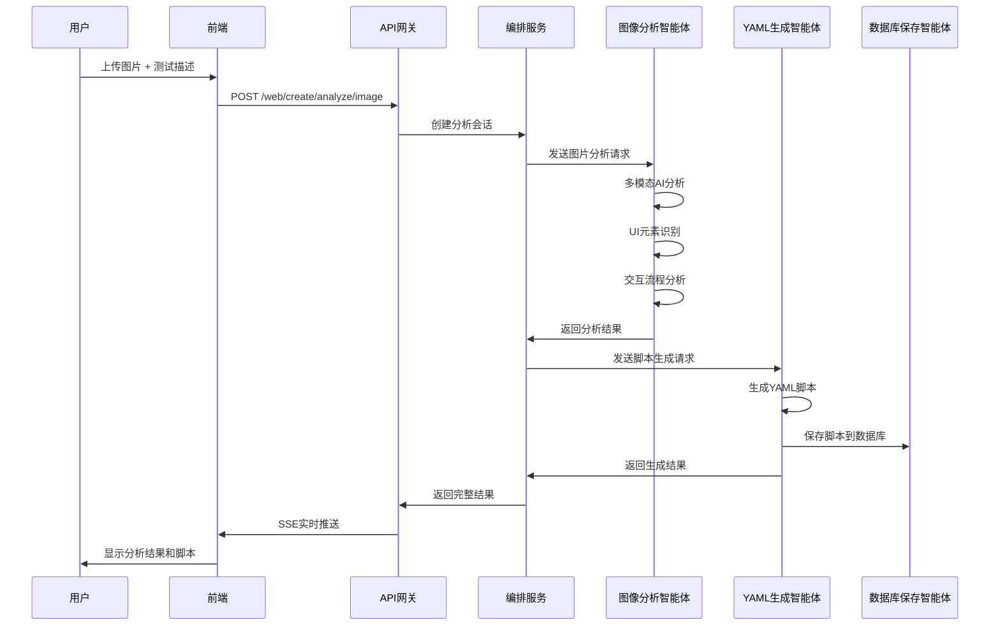
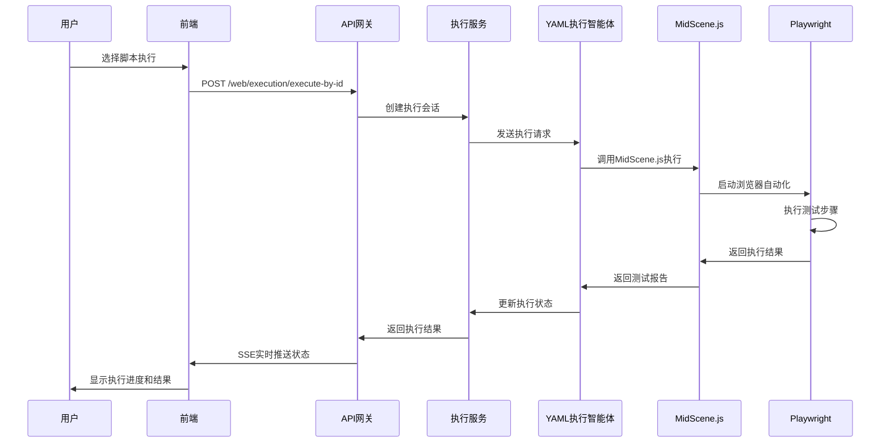
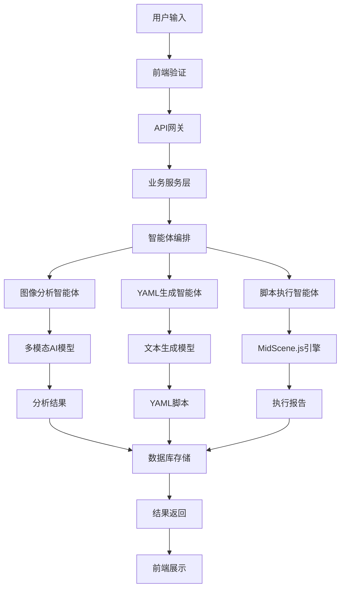
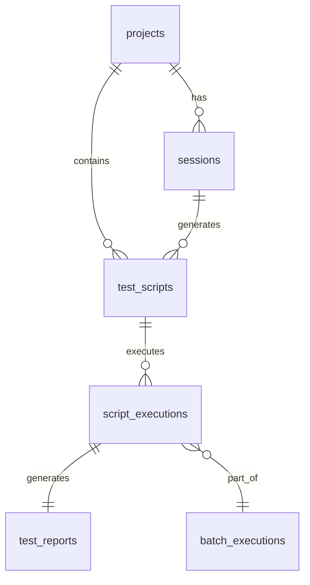
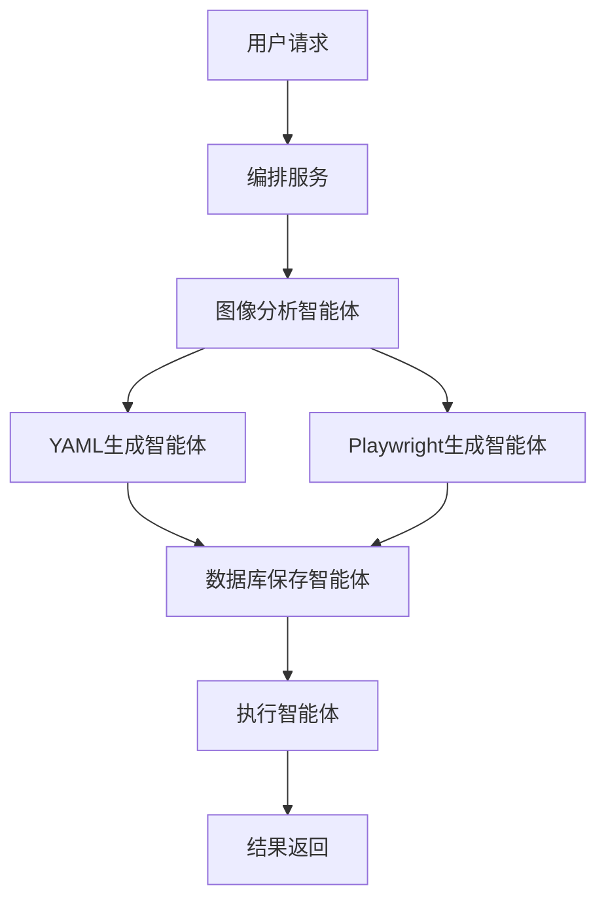

# UI自动化测试系统技术架构与业务流程总结

## 📋 系统概述

UI自动化测试系统是一个基于多模态大模型与多智能体协作的现代化自动化测试平台，支持图片分析和网页分析，自动生成MidScene.js格式的YAML测试脚本和Playwright测试脚本。

### 🎯 核心特性
- **多模态AI分析**: 支持图片上传和网页URL分析
- **智能测试生成**: 自动识别UI元素，生成测试用例
- **多格式脚本输出**: 生成MidScene.js兼容的YAML脚本和Playwright脚本
- **实时协作**: 多智能体协同工作，实时反馈
- **现代化界面**: React + Ant Design + 3D效果

## 🏗️ 技术架构

### 整体架构图

```
┌─────────────────────────────────────────────────────────────────┐
│                    UI自动化测试系统架构                          │
├─────────────────────────────────────────────────────────────────┤
│  🌐 前端层 (React + TypeScript)                                │
│  ├── 仪表盘 (Dashboard)                                        │
│  ├── 测试创建 (Test Creation)                                  │
│  ├── 测试执行 (Test Execution)                                 │
│  └── 测试结果 (Test Results)                                   │
├─────────────────────────────────────────────────────────────────┤
│  🔌 API网关层 (FastAPI)                                        │
│  ├── Web图片分析接口 (/web/create/*)                           │
│  ├── 脚本管理接口 (/web/scripts/*)                             │
│  ├── 脚本执行接口 (/web/execution/*)                           │
│  └── 测试报告接口 (/web/reports/*)                             │
├─────────────────────────────────────────────────────────────────┤
│  🔧 业务服务层                                                 │
│  ├── 编排服务 (OrchestratorService)                           │
│  ├── 图像分析服务 (ImageAnalysisService)                      │
│  ├── 脚本管理服务 (ScriptManagementService)                   │
│  └── 执行服务 (ExecutionService)                              │
├─────────────────────────────────────────────────────────────────┤
│  🤖 智能体层 (AutoGen Framework)                               │
│  ├── 图像分析智能体 (ImageAnalyzerAgent)                      │
│  ├── YAML生成智能体 (YAMLGeneratorAgent)                      │
│  ├── Playwright生成智能体 (PlaywrightGeneratorAgent)          │
│  ├── 脚本执行智能体 (YAMLExecutorAgent)                       │
│  └── 数据库保存智能体 (ScriptDatabaseSaverAgent)              │
├─────────────────────────────────────────────────────────────────┤
│  💾 数据存储层                                                 │
│  ├── MySQL (主数据库) - 项目、会话、脚本、执行记录             │
│  ├── Neo4j (图数据库) - 脚本关系、知识图谱                     │
│  └── Milvus (向量数据库) - 语义搜索、相似性匹配                │
├─────────────────────────────────────────────────────────────────┤
│  🧠 AI模型层                                                   │
│  ├── DeepSeek-Chat (文本生成)                                  │
│  ├── Qwen-VL-Max (多模态分析)                                  │
│  └── UI-TARS (GUI专用模型)                                     │
├─────────────────────────────────────────────────────────────────┤
│  🔌 集成层                                                     │
│  ├── MidScene.js (YAML脚本执行)                                │
│  ├── Playwright (浏览器自动化)                                 │
│  └── Crawl4AI (网页抓取)                                       │
└─────────────────────────────────────────────────────────────────┘
```

### 前端架构

#### 技术栈
- **框架**: React 18 + TypeScript
- **UI库**: Ant Design 5.x
- **状态管理**: Zustand
- **路由**: React Router v6
- **动画**: Framer Motion + GSAP
- **3D渲染**: Three.js + React Three Fiber
- **图表**: ECharts + D3.js
- **构建工具**: Vite

#### 核心组件结构
```
frontend/src/
├── components/           # 通用组件
│   ├── Layout/          # 布局组件
│   ├── Dashboard/       # 仪表盘组件
│   └── Common/          # 公共组件
├── pages/               # 页面组件
│   ├── Dashboard/       # 仪表盘页面
│   ├── Web/            # Web测试模块
│   │   ├── TestCreation/    # 测试创建
│   │   ├── TestExecution/   # 测试执行
│   │   └── TestResults/     # 测试结果
│   └── Settings/       # 系统设置
├── services/           # API服务
│   ├── api.ts          # 通用API客户端
│   └── unifiedScriptApi.ts  # 脚本执行API
└── styles/             # 样式文件
```

### 后端架构

#### 技术栈
- **框架**: FastAPI + Python 3.9+
- **异步**: asyncio + aiofiles + httpx
- **智能体**: AutoGen Framework
- **数据库**: SQLAlchemy + Alembic
- **缓存**: Redis + aioredis
- **日志**: Loguru
- **监控**: Prometheus

#### 核心模块结构
```
backend/app/
├── api/                # API路由层
│   └── v1/endpoints/   # API端点
│       ├── web/        # Web模块API
│       ├── sessions.py # 会话管理
│       └── system.py   # 系统管理
├── agents/             # 智能体层
│   ├── factory.py      # 智能体工厂
│   └── web/           # Web平台智能体
├── services/           # 业务服务层
│   └── web/           # Web服务
├── database/           # 数据库层
│   └── models/        # 数据模型
├── core/              # 核心模块
│   ├── config.py      # 配置管理
│   ├── llms.py        # AI模型客户端
│   └── types.py       # 类型定义
└── utils/             # 工具模块
```

## 🔄 核心业务流程

### 1. 图片分析流程



### 2. 脚本执行流程



### 3. 数据流转架构



## 💾 数据库设计

### 核心表结构

#### 1. 项目管理
- **projects**: 项目基本信息
- **sessions**: 分析会话记录
- **test_scripts**: 测试脚本管理

#### 2. 脚本管理
- **script_tags**: 脚本标签
- **script_relationships**: 脚本关系
- **script_collections**: 脚本集合

#### 3. 执行管理
- **script_executions**: 脚本执行记录
- **execution_artifacts**: 执行产物
- **batch_executions**: 批量执行

#### 4. 报告管理
- **test_reports**: 测试报告
- **test_case_results**: 测试用例结果
- **report_templates**: 报告模板

### 数据关系图



## 🤖 智能体系统

### 智能体架构

#### 1. 图像分析智能体 (ImageAnalyzerAgent)
- **功能**: 多模态图像分析，UI元素识别
- **输入**: 图片数据 + 测试描述
- **输出**: 页面分析结果 + UI元素列表

#### 2. YAML生成智能体 (YAMLGeneratorAgent)
- **功能**: 基于分析结果生成MidScene.js YAML脚本
- **输入**: 页面分析结果
- **输出**: 标准YAML测试脚本

#### 3. Playwright生成智能体 (PlaywrightGeneratorAgent)
- **功能**: 生成Playwright TypeScript脚本
- **输入**: 页面分析结果
- **输出**: Playwright测试脚本

#### 4. 脚本执行智能体 (YAMLExecutorAgent)
- **功能**: 执行YAML脚本，管理测试流程
- **输入**: YAML脚本 + 执行配置
- **输出**: 执行结果 + 测试报告

#### 5. 数据库保存智能体 (ScriptDatabaseSaverAgent)
- **功能**: 将生成的脚本保存到数据库
- **输入**: 脚本内容 + 元数据
- **输出**: 保存确认 + 脚本ID

### 智能体协作模式



## 🔧 关键技术特性

### 1. 多模态AI集成
- **DeepSeek-Chat**: 文本理解和生成
- **Qwen-VL-Max**: 图像理解和分析
- **UI-TARS**: GUI专用视觉模型

### 2. 实时通信
- **SSE (Server-Sent Events)**: 实时状态推送
- **WebSocket**: 双向实时通信
- **事件驱动架构**: 异步消息处理

### 3. 脚本执行引擎
- **MidScene.js**: YAML脚本执行
- **Playwright**: 浏览器自动化
- **并发执行**: 支持批量并行执行

### 4. 数据管理
- **混合存储**: 关系型 + 图数据库 + 向量数据库
- **缓存策略**: Redis多级缓存
- **数据同步**: 实时数据同步机制

## 📊 系统监控与运维

### 性能监控
- **API响应时间**: 接口性能监控
- **智能体执行时间**: AI处理性能
- **数据库查询性能**: SQL优化监控
- **资源使用率**: CPU、内存、磁盘监控

### 日志管理
- **结构化日志**: JSON格式日志
- **分级日志**: DEBUG/INFO/WARN/ERROR
- **日志轮转**: 按时间和大小轮转
- **日志聚合**: 集中式日志管理

### 错误处理
- **异常捕获**: 全局异常处理
- **错误重试**: 智能重试机制
- **降级策略**: 服务降级保护
- **告警通知**: 实时错误告警

## 🚀 部署架构

### 开发环境
- **前端**: Vite开发服务器 (localhost:3000)
- **后端**: FastAPI开发服务器 (localhost:8000)
- **数据库**: 本地MySQL/PostgreSQL
- **缓存**: 本地Redis

### 生产环境
- **容器化**: Docker + Docker Compose
- **负载均衡**: Nginx反向代理
- **数据库**: 高可用MySQL集群
- **缓存**: Redis集群
- **监控**: Prometheus + Grafana

## 📈 扩展规划

### 短期目标
1. **用户管理系统**: 多用户支持和权限管理
2. **API测试模块**: 接口自动化测试
3. **移动端支持**: Android/iOS自动化测试
4. **CI/CD集成**: 持续集成和部署

### 长期目标
1. **微服务架构**: 服务拆分和独立部署
2. **云原生**: Kubernetes部署和管理
3. **AI能力增强**: 更多AI模型集成
4. **生态建设**: 插件系统和第三方集成

---

*本文档基于系统当前状态生成，随着系统发展会持续更新。*
